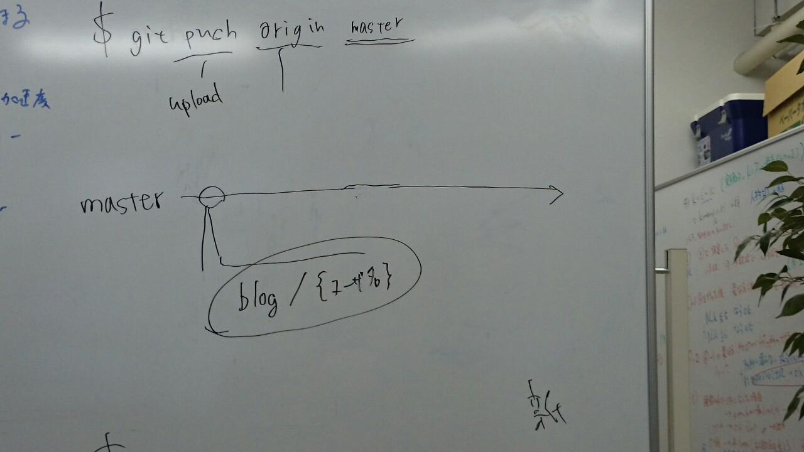

+++
date = "2017-02-16T15:30:06+09:00"
title = "Github勉強会を開催しました"
categories = []
tags = []

+++

# GitHub勉強会に参加してきました  
## タイムテーブル

|時間|内容|
|:-:|:-:|
|14:00|gitの説明|
|14:15|githubアカウントの作成|
|14:30|gitのインストール|
|14:40|pushの仕方|
|15:00|休憩|
|15:10|brunchの説明|
|15:30~|実践|
|17:00|終了|

全行程で3時間ほどでした。余裕をもって取り組むことが出来ました。

#### ブランチの説明のときの風景　　

最初よくわからなかったbrunchの事がよくわかりました。

### 場所
森本研で行いました。

## 講師の方々

中野 雄都さん  
前でプロジェクターを使ってわかりやすく説明してくれました。すごい。

中村 友惟さん  
質問すると教えに来てくれました。すごい。
